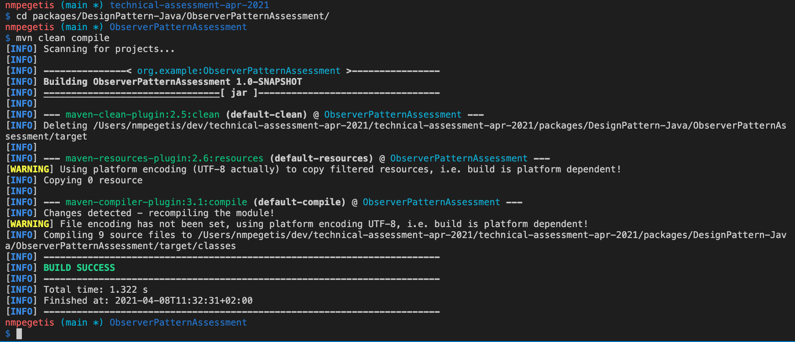
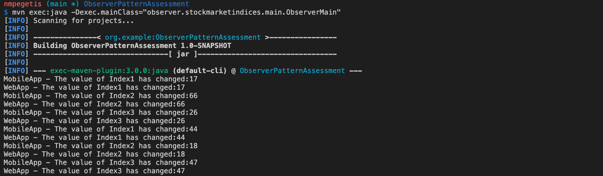
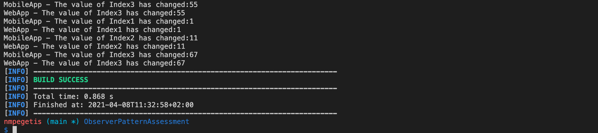

## Design Patterns Assessment in Java

Implementation for the:
* **Observer Pattern**

For the Observer Design Pattern I created a simulation for the stock market indices. 

In my implementation I have 2 hypothetical applications (a mobile app and a web app) that are registered to observe the changes on each market index and automatically be informed of any change. To show this happening I have created 3 different market indices that randomly change their values. Each value change on each index triggers both of the 2 applications informing them about the changes.

I used **Java 8** for the development and compilation of this maven project. 
In order to run you should use the following commands:

```
mvn clean compile
mvn exec:java -Dexec.mainClass="observer.stockmarketindices.main.ObserverMain"
```






