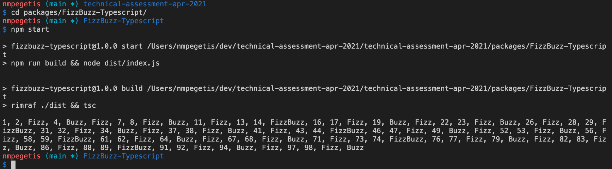
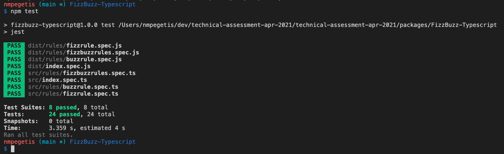
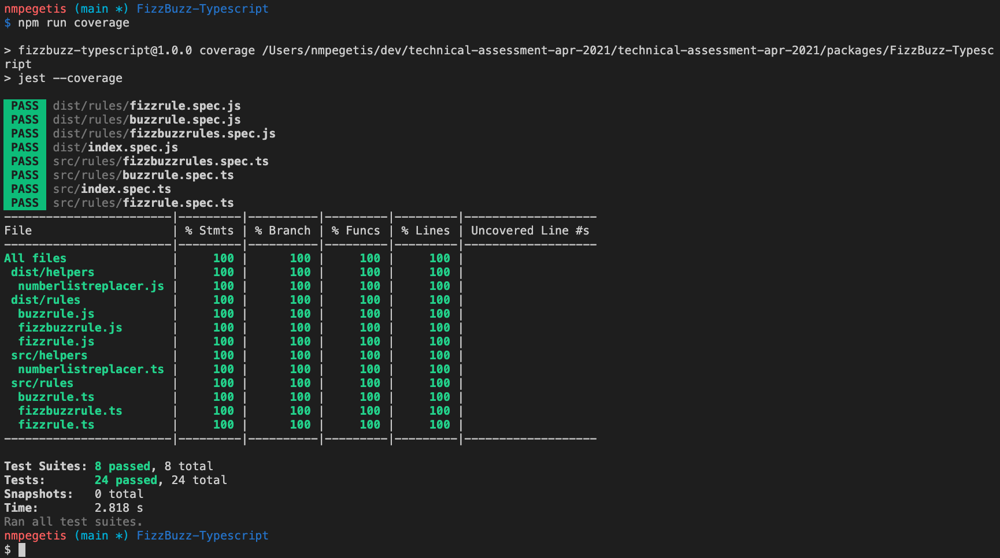

## FizzBuzz Assessment in Typescript

For the FizzBuzz assessment I decided to implement a solution using an Object-Oriented approach comparing to a functional approach.

In this implementation I also provide some testing among others. 

I used **Typescript v4.2** for the development and compilation. 
In order to run you should use the following commands:

```
npm i
npm start
```



In order to test use:
```
npm test
```



In order to see test coverage use:
```
npm run coverage
```


